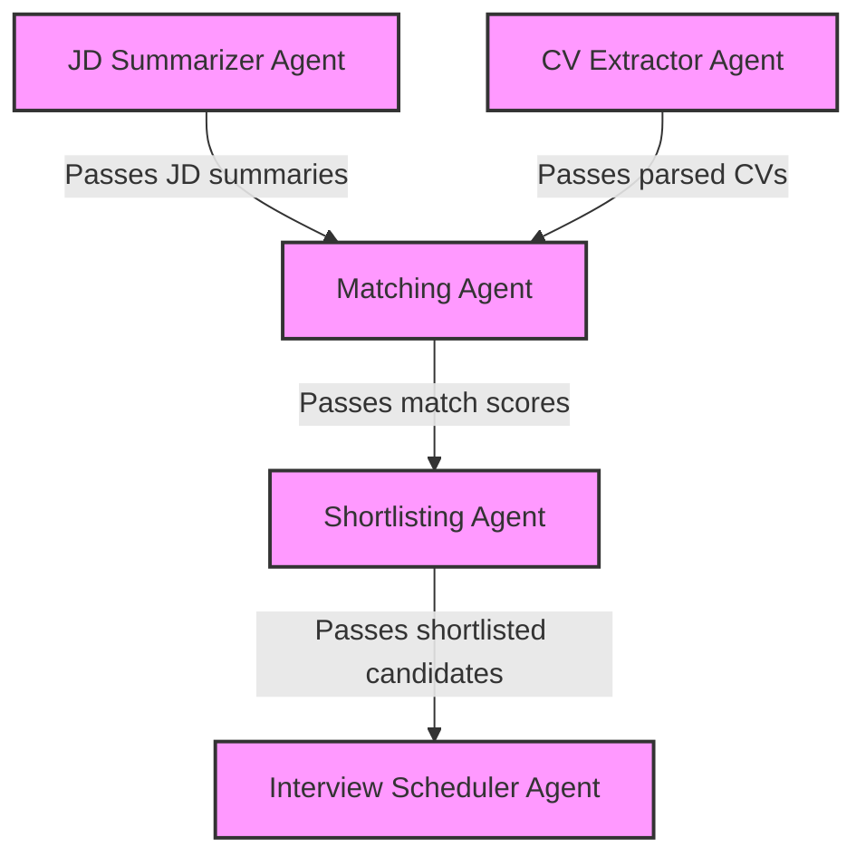

# Multi-Agent AI System for Job Screening

A complete Python system with multiple agents working together to enhance the job screening process.

## 🌟 Features

- **Job Description Summarizer Agent**: Parses JDs into structured data
- **CV Extractor Agent**: Extracts key information from PDF resumes
- **Matching Agent**: Uses embeddings to calculate match scores
- **Shortlisting Agent**: Automatically selects candidates with scores ≥ 80%
- **Interview Scheduler Agent**: Generates personalized interview emails
- **SQLite Memory Persistence**: Stores all data for future reference
- **Streamlit UI**: User-friendly interface for easy interaction
- **React Frontend**: Modern web interface with Material-UI design

## 🗂️ Project Structure

```
project/
├── main.py                 # Main entry point
├── app.py                  # Streamlit UI
├── api.py                  # FastAPI backend for React frontend
├── recruit-pro-frontend/   # React frontend application
│   ├── src/
│   │   ├── components/     # React components
│   │   ├── pages/         # Page components
│   │   ├── services/      # API services
│   │   └── App.js         # Main React app
│   ├── package.json       # React dependencies
│   └── README.md          # Frontend documentation
├── agents/                 # Agent modules
│   ├── jd_summarizer.py    # Parse and summarize job descriptions
│   ├── cv_extractor.py     # Extract structured data from resumes
│   ├── matcher.py          # Match JDs with CVs using embeddings
│   ├── shortlister.py      # Shortlist candidates based on score
│   └── emailer.py          # Send interview invitation emails
├── utils/                  # Utility modules
│   ├── embeddings.py       # Embedding generation and similarity
│   ├── parser.py           # Text parsing utilities
│   └── diagram.py          # Agent interaction diagram generator
├── db/                     # Database module
│   └── memory.py           # SQLite memory persistence
├── resumes/                # Resume PDF files
│   └── *.pdf               # Example resumes
├── job_description.csv     # Example job descriptions
├── start_react_app.bat     # Windows batch script to start React app
├── start_react_app.ps1     # PowerShell script to start React app
└── README.md               # Project documentation
```

## 🚀 Installation

1. Clone the repository:
   ```bash
   git clone https://github.com/yourusername/job-screening-system.git
   cd job-screening-system
   ```

2. Create a virtual environment:
   ```bash
   python -m venv venv
   source venv/bin/activate  # On Windows: venv\Scripts\activate
   ```

3. Install Python dependencies:
   ```bash
   pip install -r requirements.txt
   ```

4. Install React dependencies:
   ```bash
   cd recruit-pro-frontend
   npm install
   cd ..
   ```

5. Set up Ollama:
   ```bash
   # Install Ollama from https://ollama.ai/
   # Pull the required model
   ollama pull nomic-embed-text
   ```

## 📊 Usage

### Option 1: React Frontend (Recommended)

The React frontend provides a modern, responsive interface with excellent text visibility and user experience.

**Quick Start:**
```bash
# Windows
start_react_app.bat

# PowerShell
.\start_react_app.ps1
```

**Manual Start:**
```bash
# Terminal 1: Start FastAPI backend
python api.py

# Terminal 2: Start React frontend
cd recruit-pro-frontend
npm start
```

The React app will be available at: http://localhost:3000

### Option 2: Streamlit UI

Run the entire pipeline:

```bash
python main.py
```

Run the Streamlit UI:

```bash
streamlit run app.py
```

Advanced usage with options:

```bash
python main.py --jd-file path/to/jds.csv --resumes-dir path/to/resumes --threshold 85 --send-emails
```

### Command Line Arguments

- `--jd-file`: Path to job descriptions CSV file (default: job_description.csv)
- `--resumes-dir`: Directory containing resume PDFs (default: resumes)
- `--db-file`: SQLite database file path (default: memory.db)
- `--threshold`: Minimum score threshold for shortlisting (default: 80.0)
- `--send-emails`: Send interview invitation emails (default: false)
- `--diagram-type`: Type of agent interaction diagram to generate (choices: mermaid, matplotlib; default: mermaid)

## 🖥️ User Interfaces

### React Frontend (Recommended)

The React frontend offers:
- **Modern Material-UI Design**: Clean, professional interface
- **Excellent Text Visibility**: All text in dark colors for maximum readability
- **Responsive Design**: Works perfectly on desktop, tablet, and mobile
- **Real-time Updates**: Live progress tracking and status updates
- **File Upload**: Drag-and-drop file upload for job descriptions and resumes
- **Interactive Dashboard**: Statistics, charts, and progress indicators
- **API Integration**: Seamless communication with FastAPI backend

**Features:**
- Home dashboard with system overview
- Job descriptions management
- Resume upload and processing
- AI-powered candidate matching
- Automated shortlisting
- Email management system
- Database operations
- About page with system information

### Streamlit UI

The Streamlit UI provides a user-friendly interface for interacting with the job screening system:

- **Home**: Overview and full pipeline execution
- **Job Descriptions**: Process and view job descriptions
- **Resumes**: Process and view resume data
- **Matching**: Run and view candidate matching results
- **Shortlisting**: View and manage shortlisted candidates
- **Emails**: Send and track interview invitations
- **Database**: Explore the SQLite database
- **About**: System information and architecture

To launch the UI:

```bash
streamlit run app.py
```

## 🤖 How It Works

1. **JD Summarizer Agent**:
   - Parses job descriptions from CSV file
   - Extracts structured data using Ollama or rule-based extraction
   - Stores in SQLite database

2. **CV Extractor Agent**:
   - Reads PDF resumes using PyMuPDF
   - Extracts name, email, phone, education, work experience, skills, etc.
   - Stores parsed data in database

3. **Matching Agent**:
   - Creates embeddings for JDs and CVs using Ollama's nomic-embed-text model
   - Calculates cosine similarity to get match scores
   - Stores scores in database

4. **Shortlisting Agent**:
   - Filters candidates with scores above threshold (default: 80%)
   - Generates shortlist for each job
   - Stores shortlisted candidates in database

5. **Interview Scheduler Agent**:
   - Generates personalized emails for shortlisted candidates
   - Highlights matched skills from the candidate's resume
   - Simulates or sends emails using SMTP

6. **Database Module**:
   - Stores all data for persistence across runs
   - Enables querying and reporting

## 📝 Dependencies

### Python Backend
- `ollama`: For embedding generation
- `pymupdf`: For PDF parsing
- `numpy`, `scikit-learn`: For vector operations and similarity calculation
- `matplotlib`, `networkx`: For diagram generation 
- `sqlite3`: For database operations
- `streamlit`, `pandas`: For UI and data visualization
- `fastapi`, `uvicorn`: For API backend

### React Frontend
- `react`: Frontend framework
- `@mui/material`: Material-UI components
- `@mui/icons-material`: Material icons
- `react-router-dom`: Client-side routing
- `axios`: HTTP client for API calls

## 📋 Requirements

```
# Python dependencies
pymupdf==1.22.5
numpy==1.26.1
scikit-learn==1.3.1
matplotlib==3.8.0
networkx==3.2.1
ollama==0.4.7
streamlit==1.27.2
pandas==2.1.1
fastapi==0.104.1
uvicorn==0.24.0
python-multipart==0.0.6

# React dependencies (see recruit-pro-frontend/package.json)
```

## 📊 Agent Interaction Diagram



## 🚀 Quick Start with React

1. **Install dependencies:**
   ```bash
   pip install -r requirements.txt
   cd recruit-pro-frontend && npm install && cd ..
   ```

2. **Start the application:**
   ```bash
   # Windows
   start_react_app.bat
   
   # Or manually:
   # Terminal 1
   python api.py
   
   # Terminal 2
   cd recruit-pro-frontend
   npm start
   ```

3. **Open your browser:**
   - Frontend: http://localhost:3000
   - Backend API: http://localhost:8000

## 📄 License

MIT License

## ✨ Contributing

Contributions are welcome! Please feel free to submit a Pull Request. 