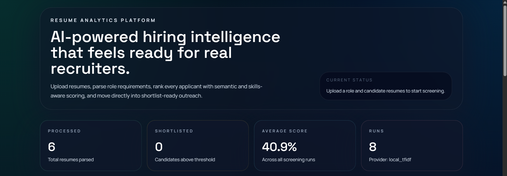
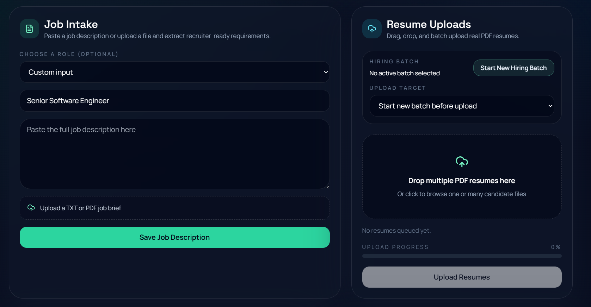
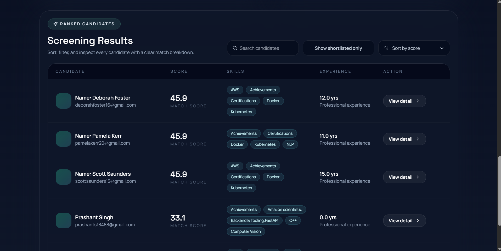
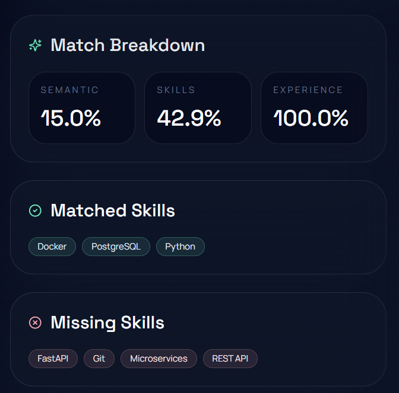

# Resume Analytics Platform

**AI-powered resume screening: upload a job description and a stack of PDF resumes, get an explainable, ranked shortlist with interview outreach drafts.**

[](https://github.com/prashant290605/Resume-Analytics-Platform/actions/workflows/ci.yml)
[](https://www.python.org/)
[](https://fastapi.tiangolo.com/)
[](https://react.dev/)
[](LICENSE)

## 🚀 Live Demo

**→ [resume-analytics-i93z.onrender.com](https://resume-analytics-i93z.onrender.com)**

> Hosted on Render's free tier — the first request after idle can take up to a minute to cold-start. Try it: paste any JD (or pick a built-in role), upload PDFs from [`samples/`](samples/), and run a screening.

**Measured performance:** parses and ranks a **200-resume batch in under 1 second** on the deterministic TF-IDF path ([benchmarks](#benchmarks)).

## Features

- **PDF resume parsing** — extracts name, contact, skills, experience, and education from real-world resume PDFs (PyMuPDF + section heuristics)
- **Hybrid scoring engine** — ranks candidates by weighted **semantic similarity + skill overlap + experience fit**, not just cosine similarity
- **Explainable results** — per-candidate breakdown with matched and missing skills persisted for every screening run
- **Pluggable embeddings** — Ollama (`nomic-embed-text`) when available, automatic fallback to deterministic TF-IDF; active provider recorded per run
- **Hiring batches** — group uploads into batches and screen them independently
- **Outreach drafts** — shortlisted candidates get a generated interview invitation draft
- **Recruiter dashboard** — aggregate metrics, ranked results with search/sort/filter, candidate detail views
- **Production hardening** — upload validation (magic bytes, size caps), env-driven config, structured request logging, Prometheus `/metrics`, Dockerized deploy

## Screenshots

| Dashboard | Job intake & uploads |
|---|---|
|  |  |

| Ranked screening results | Explainable match breakdown |
|---|---|
|  |  |

## Architecture

```text
            ┌─────────────────────┐
            │   React + Tailwind  │  nginx-served SPA, /api proxied
            └──────────┬──────────┘
                       │ REST
            ┌──────────▼──────────┐
            │   FastAPI backend   │  DI composition root (lifespan)
            ├─────────────────────┤
            │ api/      routes + validation (magic bytes, size caps)
            │ services/ parsing · hybrid scoring · screening · email
            │ db/       SQLite repository (WAL, indexed)
            │ core/     env-driven settings · logging
            └──────────┬──────────┘
             ┌─────────▼─────────┐
             │ EmbeddingProvider │  Protocol: Ollama ──fallback──▶ TF-IDF
             └───────────────────┘
```

Key design decisions (full rationale in [docs/ARCHITECTURE.md](docs/ARCHITECTURE.md)):

- **Dependency injection.** Long-lived objects are built once in the FastAPI lifespan and injected via `Depends` — no import-time singletons, trivially testable.
- **Provider fallback over hard dependency.** The system is fully functional with zero external services; higher-quality embeddings are an upgrade, not a requirement.
- **SQLite on purpose.** Single-tenant tool: WAL mode, covering indexes, zero ops. The repository layer isolates SQL so a Postgres migration touches one module.
- **Deliberate non-goals.** No auth (single-tenant by design) and no task queue (batches finish in <1 s) — documented tradeoffs, not omissions.

## Tech Stack

| Layer | Technology |
|---|---|
| Backend | Python 3.12, FastAPI, Pydantic v2, pydantic-settings |
| Scoring | scikit-learn (TF-IDF), Ollama embeddings (optional), custom hybrid ranker |
| Parsing | PyMuPDF |
| Database | SQLite (WAL, indexed), repository pattern |
| Frontend | React (Vite), Tailwind CSS, axios |
| Ops | Docker (multi-stage, non-root), Docker Compose, nginx, GitHub Actions, Prometheus metrics |
| Testing | pytest (27 tests), ruff |

## Installation

```bash
git clone https://github.com/prashant290605/Resume-Analytics-Platform.git
cd Resume-Analytics-Platform

# Backend (Python 3.11+)
make install            # pip install -r backend/requirements-dev.txt
make run                # API on http://localhost:8000 (docs at /docs)

# Frontend
make dev                # installs frontend deps
make frontend           # dev server on http://localhost:5173
```

Configuration is env-driven with sane defaults — copy [.env.example](.env.example) to `.env` to customize (`RAP_DATA_DIR`, `RAP_OLLAMA_BASE_URL`, `RAP_MAX_UPLOAD_BYTES`, `RAP_CORS_ORIGINS`, ...).

## Docker

```bash
docker compose up --build            # frontend :3000, API :8000
docker compose --profile ollama up   # + Ollama for higher-quality embeddings
```

Backend image: multi-stage `python:3.12-slim`, non-root user, healthcheck. Frontend image: Node build → nginx serving the SPA and proxying `/api`. Data persists in the `rap-data` volume.

## API

| Method | Path | Description |
|---|---|---|
| GET | `/api/health` | Health + active embedding provider |
| GET | `/api/dashboard` | Aggregate metrics |
| POST | `/api/jobs` | Upload JD (text or PDF) |
| GET | `/api/jobs` | List JDs |
| POST | `/api/resumes` | Upload resume PDFs (validated) |
| POST | `/api/batch/create` | Create a hiring batch |
| POST | `/api/batch/{id}/upload` | Upload resumes into a batch |
| POST | `/api/screenings/run` | Rank all/batch resumes against a JD |
| GET | `/api/results` | Ranked results with score breakdowns |
| GET | `/api/candidates/{id}` | Candidate detail + outreach draft |
| GET | `/metrics` | Prometheus metrics |

Interactive OpenAPI docs: [`/docs`](https://resume-analytics-i93z.onrender.com/docs) on any running instance.

## Usage

1. **Add a job description** — paste text, upload a TXT/PDF brief, or pick a built-in role.
2. **Upload resumes** — drag-and-drop PDFs (optionally into a named hiring batch). Uploads are validated by extension, `%PDF` magic bytes, and size.
3. **Run screening** — choose the role and shortlist threshold; the hybrid engine scores every candidate.
4. **Review results** — sort/search the ranked table, open any candidate for the semantic/skills/experience breakdown with matched vs. missing skills, and grab the generated outreach draft for shortlisted candidates.

## Benchmarks

Measured on the TF-IDF fallback path (no GPU, no external services):

| Operation | Result |
|---|---|
| Parse 200 PDF resumes | 0.61 s |
| Score + rank 200 candidates | 0.07 s |
| End-to-end batch screening | **0.68 s** |

## Testing & Quality

- **27 pytest tests** — parsing units, scoring properties (bounds, ordering, disjoint matched/missing sets), repository round-trips on isolated temp DBs, and end-to-end API workflows including upload validation and error paths (400/404/413)
- **CI on every push** — ruff lint, pytest, frontend build, and Docker image builds ([workflow](.github/workflows/ci.yml))
- **Observability** — structured request logs with latency, `X-Response-Time-Ms` header, Prometheus `/metrics`

```bash
make test && make lint
```

## Deployment

The live demo runs on **Render**: backend Web Service from `backend/Dockerfile` with a persistent disk at `/data`, frontend served alongside. Full steps for Render and Railway (plus a go-live checklist) in [docs/DEPLOYMENT.md](docs/DEPLOYMENT.md).

## Future Improvements

- **Embedding cache** — persist Ollama embeddings keyed by content hash to cut repeat-screening latency in embedding mode
- **Postgres option** — contained to the repository layer; worthwhile once multi-tenant or concurrent-writer requirements appear
- **LLM-based extraction** — swap heuristic resume parsing for structured LLM extraction (at which point an async task queue earns its place)
- **Auth & multi-tenancy** — API keys + per-recruiter workspaces if the tool outgrows single-tenant use
- **Richer JD parsing** — weight must-have vs. nice-to-have skills separately in the ranker

## License

MIT © [Prashant Singh](https://github.com/prashant290605)
